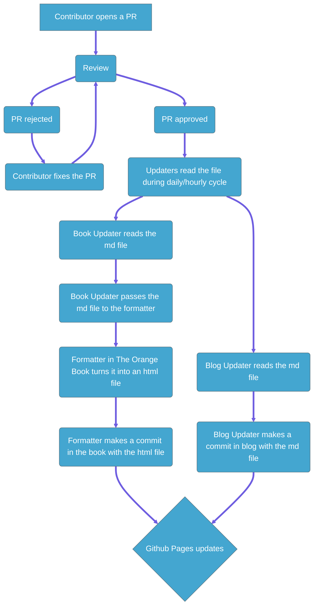

# the orange storage*

*\*to be completed. for now, make a pr in the-orange-blog and dm either raptorly1 or orangememoryyarn on discord to get your pr approved*

## What is it?
  The Orange Storage is where we store all our articles in markdown!  
  To use our articles with both book and blog, we needed a single place to keep the files: here! Here's how the current update process works: 

  It's all automatic! 
  
  Doing it this way:
  - saves time (we don't need to convert docs manually)
  - ensures consistency (we'll never need to worry about document versions across the book and blog)
  - avoids error (no more markdown files for us to move around)
  
  
## Can I read it as a blog?
  Yes! The orange blog can be found [here](https://Orange-Depot.github.io/the-orange-blog/)!

## Can I contribute?
  Yes! We welcome contributions. If you'd like to help out, open a PR!
